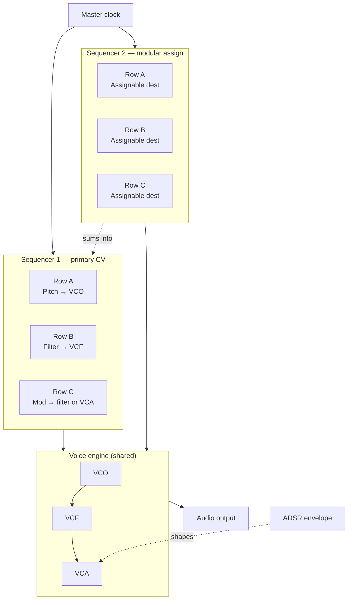
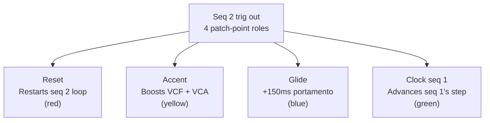

# SQ-24 dual analog sequencer — signal flow

## Overall architecture

Seq 1's three rows feed pitch, filter, and the row-C mod destination
directly. Seq 2's rows can each be routed (via the per-row dropdown) into
any of those same targets — plus decay time or glide time — so its values
**sum with** Seq 1's before hitting the shared VCO → VCF → VCA chain. The
ADSR envelope shapes the amplitude (and filter) stage on every step.

## Sequencer 2 trigger routing

Seq 2's patch-point row isn't audio — it's a routing switch. Only one role
is active at a time, chosen by the `TRIG ASSIGN` dropdown, and the lit
patch-point color matches the active role (red / yellow / blue / green).

---
*Schematics for the SQ-24 Dual Analog Sequencer by Jose Velazquez MA — [Voltage & Wave](https://voltageandwave.co.uk/)*
